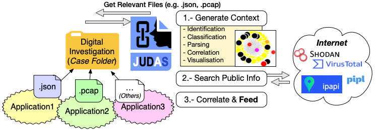
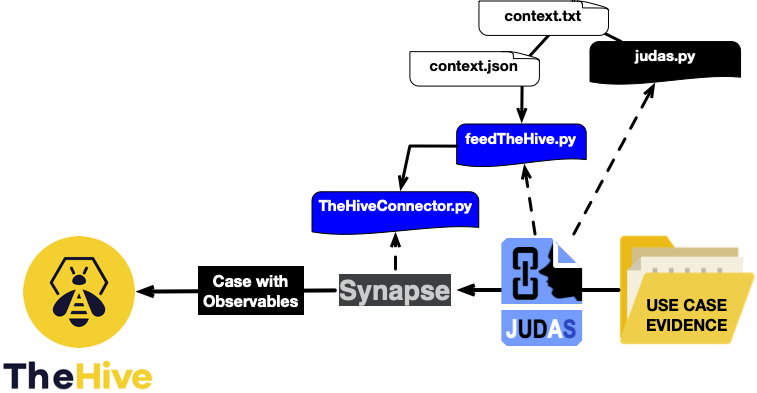
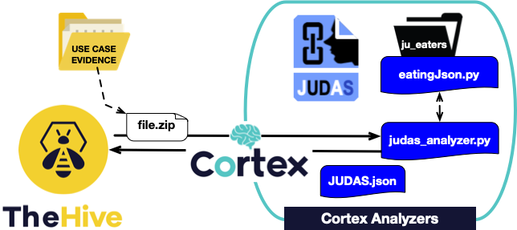

JUDAS process files in order to identify relationships between users and devices. This solution depends on the format 
of the files, so please take a look and modify what you need to process your files.

This work has been supported by the [EU H2020-SU-ICT-03-2018 Project No. 830929 CyberSec4Europe](cybersec4europe.eu), where [NICS Lab](https://www.nics.uma.es) is one of the partners.

# Overview

JUDAS creates an interpretation of the context of a digital investigation, starting by processing the JSON files.
JUDAS will identify all the data that is relevant to users and devices, following a set of criteria defined during the 
parsing of the files.
The solution uses hooks to read from JSONs and create the objects of the context. At the end only objects with different
identifiers survives and form part of the context. The tool recognise equal items and combines all the information in
a single object. Also, some checks with open source intelligence (OSINT) services are developed.

Currently, JUDAS process .json files from an Alexa Cloud environment. 

Further details are publised in : 
[Nieto, Ana. "Becoming JUDAS: Correlating Users and Devices During a Digital Investigation." 
IEEE Transactions on Information Forensics and Security 15 (2020): 3325-3334.](https://www.nics.uma.es/biblio/citekey/judas2020)

# How to use JUDAS

Download the code. conf/judas.conf contains the basic options to work with JUDAS. Please, modify this file before 
the execution of the main file, judas.py.  

By default JUDAS 'eats' all the files of interest in a digital investigation case folder. The folder 'sources' contains
a set of files that can be used for testing. However, you can select another folder by modifying judas.conf.

A GUI is provided (judas.py) in order to test some basic features:
   * 'Show JUDAS context' shows all the objects created to represent the context.
   * 'Plot' shows graphically the context. '.gif' only for users and devices, 'Web' to visualise all the objects and the
   relationships in the browser.
   * 'Show IDs' shows only the identifiers for the objects in the context.
   * 'Acquire Public Info' checks public information about users, devices or network data in the context.

Regarding the different tabs:
   * 'Files' list the files loaded to create the context.
   * 'API Keys' loads the API keys from judas.conf for external services (e.g. Shodan, VirusTotal).
PassiveTotal is included but finally is not used in practice (yet).
   * 'Report' prints the results of some operations to simplify the traceability of the operations made with the
tool and then help in the reporting.

A small video showing the tool can be seen [here](NOTYET).

# Integration with TheHive

This version of JUDAS is prepared to send the context to [TheHive](https://thehive-project.org/). The context generated 
by JUDAS is stored in context.txt. This file is processed by judas.py in order to create a new file, context.json, that 
will contains the data to create the case in TheHive and the observables for the case. 
There are two main files to work with this: feedTheHive.py and TheHiveConnect.py. The last one belongs to Synapse and 
has been modified to add a new method for generic observables. 

Remember!! you must modify judas.conf to include the data about TheHive. 

Take into account that using TheHive you are "breaking" the context in a set of pieces, so this is useful only if you 
want to use the analyzers provided by TheHive. You can use the tags included by JUDAS in order to put the pieces 
together (e.g. by selecting the ID for a particular User).

# Integration with Cortex

A proof of concept has been prepared in order to test JUDAS as Cortex Analyzer. In particular, the files JUDAS.conf and 
judas_analyzer.py can be used to create the new analyzer. However, there are multiple dependencies with the GUI, so in 
this case only a modified version of eatingJson.py is used for the integration.

This analyzer takes a file.zip containing a set of JSON files from Alexa and generates the context. 

# Last but not less... 

If you find this application or my work interesting, please do not forget to reference it ;-) 

Thank you for your interest and enjoy!!!
